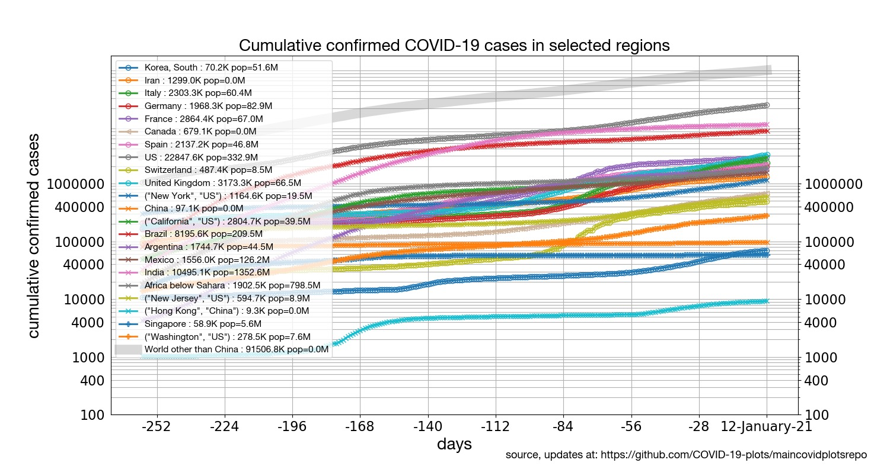
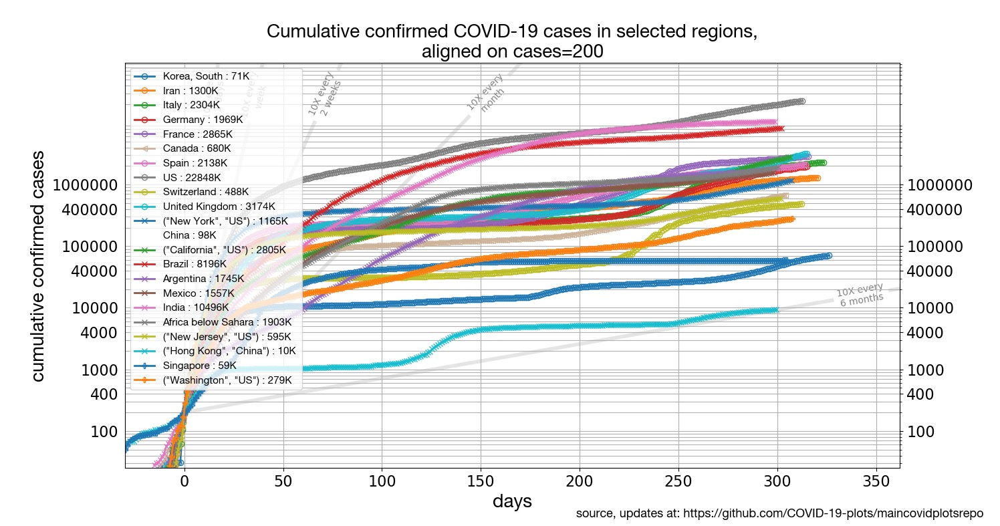

# COVID-19-plots

*To make a comment or suggestion, please click on the ["Issues"](https://github.com/COVID-19-plots/maincovidplotsrepo/issues) tab at the top and add to the thread of an existing issue or click on ["New Issue"](https://github.com/COVID-19-plots/maincovidplotsrepo/issues/new/choose) to add a new thread.* 

---

Four different types of plots are provided on this page, each showing data for multiple different selected regions from around the world. (A) [growth rates](#daily-percentile-growth-rates-in-confirmed-cases-per-country); (B) [cumulative counts](#cumulative-number-of-confirmed-cases-per-country); (C) [cumulative counts aligned on equal caseload](cumulative-number-of-confirmed-cases-aligned-on-equal-caseload); (D) [new daily counts](new-cases-per-day-and-by-region). For a pointer to the data sources (mostly Johns Hopkins), please click **[here](#data-sources)**. Please note that all confirmed case counts are strongly modulated by test availability and testing practices.

* Click on the following links for pages focusing on [States of the US](./states) | [Latin America](./latinamerica) | [Europe](./europe) | [Mortality](./mortality).

### Daily percentile growth rates in confirmed cases per country

Click on the plot to see an expanded version.

 

This plot shows the percentage daily growth in number of confirmed cases for a selected set of countries. For each country, the data plot starts after 50 cases were reached (it is too noisy before that). Note that net number of confirmed cases can change over time due to many factors, including test availability, test applications, reporting accuracy, etc. These plots simply show the available data as is.

Caseloads growing at a contsant exponential rate  correspond to a horizontal line in this plot. In other words, although growth rate in Japan is comparatively slower than others, it is still exponential growth. Mainland China is the orange line at the bottom, near zero.

### Cumulative number of confirmed cases per country

Click on the plot to see an expanded version.

This plot shows total number of confirmed cases, for the same countries as the first plot (same color code also). Since the vertical axis is logarithmic, percentage daily growth (in the first plot) is proportional to the slope of the lines in this plot. China is the orange line at the top. 

### Cumulative number of confirmed cases, aligned on equal caseload

Click on the plot to see an expanded version.

First spotted on Adam J Calhoun's [facebook feed](https://www.facebook.com/photo.php?fbid=10101610112688432&set=a.10100591572231672&type=3), this plot is the same as the previous plot, but now each country's timeline is shifted horizontally so that 0 on the horizontal axis corresponds to the moment the caseload hit 200 cases. The legend indicates, for each region, how many days ago that happened.

### New cases per day and by region

Click on the plot to see an expanded version.

**2020-March-29**: It looks like the number of new cases per day is beginning to not grow exponentially, but stay steady. A sign of social distancing working? But I fear that might be merely because the number of actual cases is now exceeding, in many regions, their testing capacity. 

---

## Blog

#### 2020-March-23 : South Korea seems stuck.

South Korea is correctly highly praised, and has brought it's growth rate way down to 1.5% new cases per day. But it's stuck. It's been like that for 10 days. As long as it stays like that, it means the country can't go back to fully normal. They might have to change their strategy in some way, add some new approach if they are to get back to normal.

#### 2020-March-23 : Social distancing is not yet working in Italy. 

It's been 14 days since Italy went on national lockdown, on March 9th. While daily growth rate came down below 20%, it is still above 10%. At that rate, its hospitals will be twice as overwhelmed every 9 days. Terrifyingly, that means it's going to get a lot worse there.

#### 2020-March-23 : No signs of warmer weather regions being different. 

Growth rates in Australia, Brazil, Africa below the Sahara, India, are all in the 20% to 30% or more per day, just like everywhere else. India was an exception until recently, but sadly, is not an exception any more.

#### 2020-March-09 : Signs of a trend?

~Spain had a terrible day, Italy continues to rage unabated, but in the rest of Europe... noise? changes in testing? Or the beginning signs of a possibly encouraging trend?~ Update: downwards trend went away after one day. Meant nothing.  :(

#### 2020-March-06 : One possible conclusion

Three of the countries with the largest caseloads as of 6-March-2020, namely China, South Korea, and Italy, are also countries with some of the smallest growth rates, specially China and South Korea. Their experience has clearly led them to learn something about how to deal with COVID-19. But the rest of the world hasn't learned from *them*: almost everyone starts at growth rates much higher than the current growth rates in those countries.

Perhaps the problem is political: perhaps it takes 500+ cases within your own borders before the measures needed to contain growth become politically feasible, even if your neighbor already went through it. And even if limiting growth would be of course far easier at the start, when you have fewer cases.

---

### Data sources

We are grateful to our data sources:

* The open availability of the [database](https://github.com/CSSEGISandData/COVID-19) for the [Johns Hopkins COVID-19 dashboard](https://gisanddata.maps.arcgis.com/apps/opsdashboard/index.html#/bda7594740fd40299423467b48e9ecf6) (their [mobile version here](https://www.arcgis.com/apps/opsdashboard/index.html#/85320e2ea5424dfaaa75ae62e5c06e61)) makes these plots possible.
* US and US state-level data are from https://covidtracking.com

### Update frequency

Although the [Johns Hopkins COVID-19 dashboard](https://gisanddata.maps.arcgis.com/apps/opsdashboard/index.html#/bda7594740fd40299423467b48e9ecf6) is updated frequently, they update their [database](https://github.com/CSSEGISandData/COVID-19) with the time series only once a day. I will likely update these once a day also.

