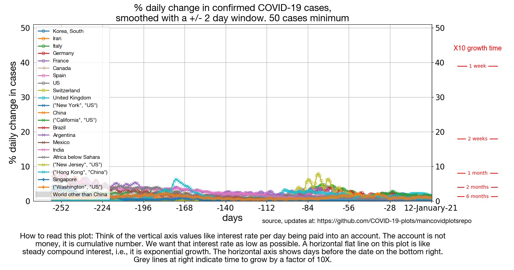
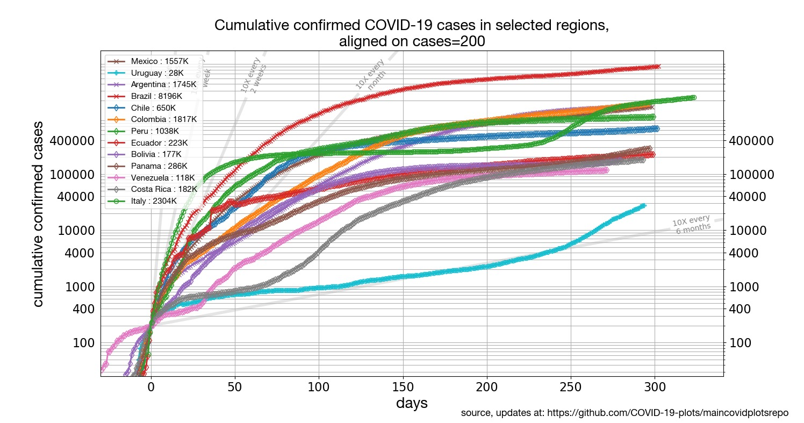
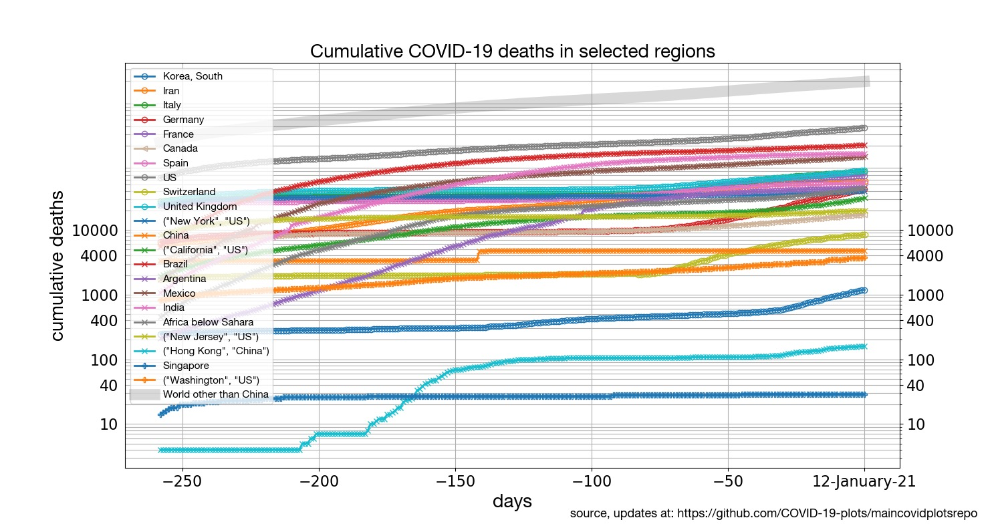
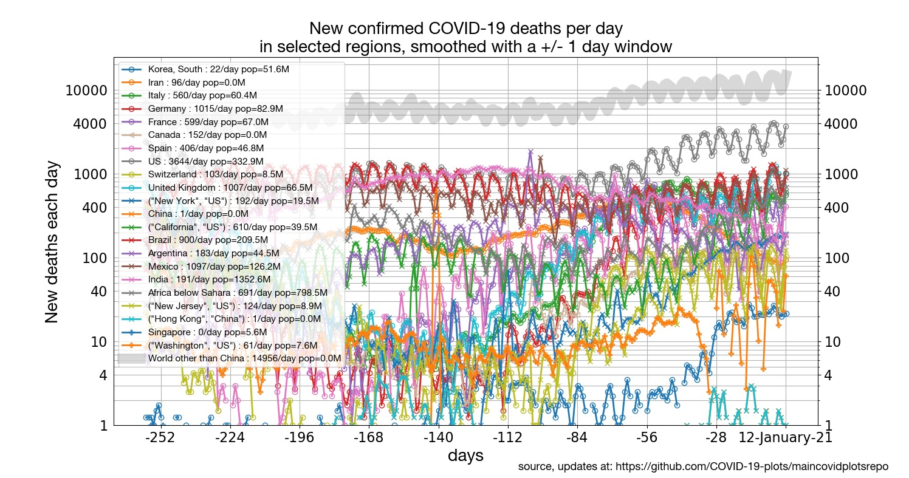
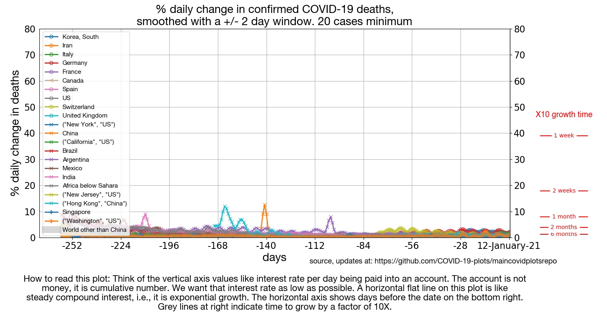

# COVID-19-plots

We are grateful to our data sources:

* The open availability of the [database](https://github.com/CSSEGISandData/COVID-19) for the [Johns Hopkins COVID-19 dashboard](https://gisanddata.maps.arcgis.com/apps/opsdashboard/index.html#/bda7594740fd40299423467b48e9ecf6) (their [mobile version here](https://www.arcgis.com/apps/opsdashboard/index.html#/85320e2ea5424dfaaa75ae62e5c06e61)) makes these plots possible.
* US and US state-level data are from https://covidtracking.com

### Plot types

Four different types of plots are provided for 
* a variety of regions aroung the globe; 
* US States; 
* Latin America; 
* death counts for a variety of regions aroung the globe.

The four main types of plots provided are: growth rates; cumulative counts; cumulative counts aligned on equal caseload; new daily counts.

### Plot listing

#### [Confirmed cases around the world](https://github.com/COVID-19-plots/maincovidplotsrepo#confirmed-cases-plots-1):

* [Daily percentile growth rates in confirmed cases by region](https://github.com/COVID-19-plots/maincovidplotsrepo#daily-percentile-growth-rates-in-confirmed-cases-per-country)
* [Cumulative number of confirmed cases by region](https://github.com/COVID-19-plots/maincovidplotsrepo#cumulative-number-of-confirmed-cases-per-country)
* [Cumulative number of confirmed cases by region, aligned on equal caseload](https://github.com/COVID-19-plots/maincovidplotsrepo#cumulative-number-of-confirmed-cases-aligned-on-equal-caseload)
* [New cases per day and by region](#new-cases-per-day-and-by-region)

#### [US States confirmed cases](#focus-on-us-states):

* [States of the US: Daily percentile growth rates](https://github.com/COVID-19-plots/maincovidplotsrepo#states-of-the-us-daily-percentile-growth-rates)
* [States of the US: cumulative number of confirmed cases by state, aligned on equal caseload](#states-of-the-us-cumulative-number-of-confirmed-cases-aligned-on-equal-caseload)
* [States of the US: Cumulative number of cases](#states-of-the-us-cumulative-number-of-cases)
* [States of the US: New cases per day](#states-of-the-us-new-cases-per-day)

#### [Latin America confirmed cases](#focus-on-latin-america):

* [Latin America: Daily percentile growth rates](#daily-percentile-growth-rates-in-confirmed-cases-in-latin-america)
* [Latin America: cumulative number of confirmed cases, aligned on equal caseload](#latin-america-cumulative-number-of-cases-aligned-on-equal-caseload)
* [Latin America: Cumulative number of cases](#latin-america-cumulative-number-of-cases)
* [Latin America: New cases per day](#latin-america-new-cases-per-day)

#### [Mortality plots](https://github.com/COVID-19-plots/maincovidplotsrepo#mortality-plots-1)

* [Cumulative number of COVID-19 deaths by region](https://github.com/COVID-19-plots/maincovidplotsrepo#cumulative-number-of-covid-19-deaths-by-region)
* [New deaths per day by region](https://github.com/COVID-19-plots/maincovidplotsrepo#new-deaths-per-day-by-region)
* [Daily percentile growth rates in COVID-19 deaths by region](https://github.com/COVID-19-plots/maincovidplotsrepo#daily-percentile-growth-rate-in-covid-19-deaths-by-region)

#### Blog noting some brief observations:

* [Blog with comments](https://github.com/COVID-19-plots/maincovidplotsrepo#blog)

## Confirmed cases plots

### Daily percentile growth rates in confirmed cases per country

This plot shows the percentage daily growth in number of confirmed cases for a selected set of countries. For each country, the data plot starts after 50 cases were reached (it is too noisy before that). Note that net number of confirmed cases can change over time due to many factors, including test availability, test applications, reporting accuracy, etc. These plots simply show the available data as is.

Caseloads growing at a contsant exponential rate  correspond to a horizontal line in this plot. In other words, although growth rate in Japan is comparatively slower than others, it is still exponential growth. Mainland China is the orange line at the bottom, near zero.

Click on the plot to see an expanded version.

 

### Cumulative number of confirmed cases per country

This plot shows total number of confirmed cases, for the same countries as the first plot (same color code also). Since the vertical axis is logarithmic, percentage daily growth (in the first plot) is proportional to the slope of the lines in this plot. China is the orange line at the top. 

Click on the plot to see an expanded version.

### Cumulative number of confirmed cases, aligned on equal caseload

First spotted on Adam J Calhoun's [facebook feed](https://www.facebook.com/photo.php?fbid=10101610112688432&set=a.10100591572231672&type=3), this plot is the same as the previous plot, but now each country's timeline is shifted horizontally so that 0 on the horizontal axis corresponds to the moment the caseload hit 200 cases. The legend indicates, for each region, how many days ago that happened.

Click on the plot to see an expanded version.

### New cases per day and by region

Click on the plot to see an expanded version.

## Focus on US states

### States of the US: Daily percentile growth rates

Click on the plot to see an expanded version.

### States of the US: cumulative number of confirmed cases, aligned on equal caseload

Click on the plot to see an expanded version.

### States of the US: Cumulative number of cases

Click on the plot to see an expanded version.

### States of the US: New cases per day

Click on the plot to see an expanded version.

## Focus on Latin America

### Daily percentile growth rates in confirmed cases in Latin America

Click on the plot to see an expanded version.

### Latin America: Cumulative number of cases, aligned on equal caseload

Click on the plot to see an expanded version.

### Latin America: Cumulative number of cases

Click on the plot to see an expanded version.

### Latin America: New cases per day

Click on the plot to see an expanded version.

## Mortality plots

Making these mortaility plots made me cry. I know that people die all the time. Even without a pandemic, on the order of 8 million people a month pass away. COVID-19 deaths are at an early enough point in their exponential growth that they are very small compared to that. But I had never before been personally involved in counting deaths. It is very grim.

### Cumulative number of COVID-19 deaths by region

Click on the plot to see an expanded version.

### New deaths per day by region

Click on the plot to see an expanded version.

### Daily percentile growth rate in COVID-19 deaths by region

Click on the plot to see an expanded version.

## Blog

#### 2020-March-23 : South Korea seems stuck.

South Korea is correctly highly praised, and has brought it's growth rate way down to 1.5% new cases per day. But it's stuck. It's been like that for 10 days. As long as it stays like that, it means the country can't go back to fully normal. They might have to change their strategy in some way, add some new approach if they are to get back to normal.

#### 2020-March-23 : Social distancing is not yet working in Italy. 

It's been 14 days since Italy went on national lockdown, on March 9th. While daily growth rate came down below 20%, it is still above 10%. At that rate, its hospitals will be twice as overwhelmed every 9 days. Terrifyingly, that means it's going to get a lot worse there.

#### 2020-March-23 : No signs of warmer weather regions being different. 

Growth rates in Australia, Brazil, Africa below the Sahara, India, are all in the 20% to 30% or more per day, just like everywhere else. India was an exception until recently, but sadly, is not an exception any more.

#### 2020-March-09 : Signs of a trend?

~Spain had a terrible day, Italy continues to rage unabated, but in the rest of Europe... noise? changes in testing? Or the beginning signs of a possibly encouraging trend?~ Update: downwards trend went away after one day. Meant nothing.  :(

#### 2020-March-06 : One possible conclusion

Three of the countries with the largest caseloads as of 6-March-2020, namely China, South Korea, and Italy, are also countries with some of the smallest growth rates, specially China and South Korea. Their experience has clearly led them to learn something about how to deal with COVID-19. But the rest of the world hasn't learned from *them*: almost everyone starts at growth rates much higher than the current growth rates in those countries.

Perhaps the problem is political: perhaps it takes 500+ cases within your own borders before the measures needed to contain growth become politically feasible, even if your neighbor already went through it. And even if limiting growth would be of course far easier at the start, when you have fewer cases.

### Update frequency

Although the [Johns Hopkins COVID-19 dashboard](https://gisanddata.maps.arcgis.com/apps/opsdashboard/index.html#/bda7594740fd40299423467b48e9ecf6) is updated frequently, they update their [database](https://github.com/CSSEGISandData/COVID-19) with the time series only once a day. I will likely update these once a day also.

