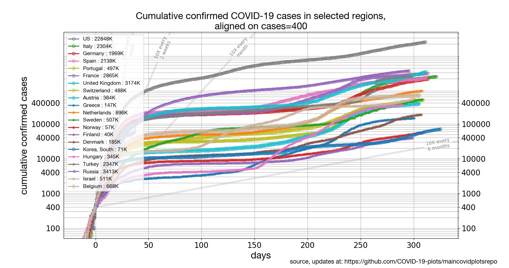
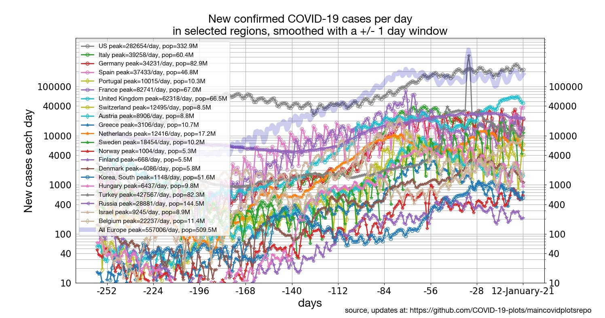

[[Regions around the world](../README.md) | [States of the US](../states) | [Latin America](../latinamerica) | [Mortality](../mortality)]

## [Europe confirmed cases](#focus-on-us-states):

* [Europe: Daily percentile growth rates](#europe-daily-percentile-growth-rates)
* [Europe: cumulative number of confirmed cases by state, aligned on equal caseload](#europe-cumulative-number-of-confirmed-cases-aligned-on-equal-caseload)
* [Europe: Cumulative number of cases](#europe-cumulative-number-of-cases)
* [Europe: New cases per day](#europe-new-cases-per-day)

## Focus on Europe

### Europe: Daily percentile growth rates

Click on the plot to see an expanded version.

### Europe: cumulative number of confirmed cases, aligned on equal caseload

Click on the plot to see an expanded version.

### Europe: Cumulative number of cases

Click on the plot to see an expanded version.

### Europe: New cases per day

Click on the plot to see an expanded version.

