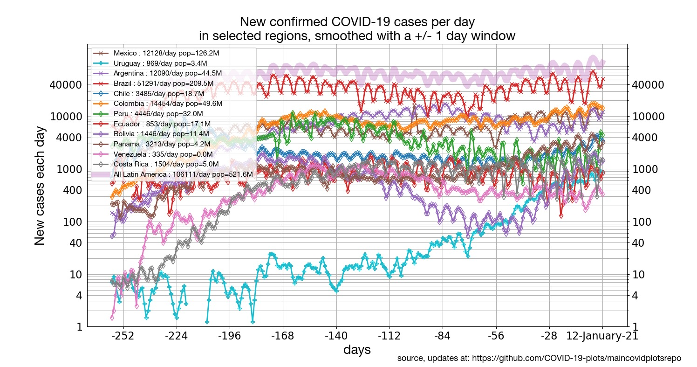

[[Regions around the world](../README.md) | [States of the US](../states) | [Latin America](../latinamerica) | [Europe](../Europe) | [Mortality](../mortality)]

## [Latin America confirmed cases](#focus-on-latin-america):

* [Latin America: Daily percentile growth rates](#daily-percentile-growth-rates-in-confirmed-cases-in-latin-america)
* [Latin America: cumulative number of confirmed cases, aligned on equal caseload](#latin-america-cumulative-number-of-cases-aligned-on-equal-caseload)
* [Latin America: Cumulative number of cases](#latin-america-cumulative-number-of-cases)
* [Latin America: New cases per day](#latin-america-new-cases-per-day)

## Focus on Latin America

### Daily percentile growth rates in confirmed cases in Latin America

Click on the plot to see an expanded version.

### Latin America: Cumulative number of cases, aligned on equal caseload

Click on the plot to see an expanded version.

### Latin America: Cumulative number of cases

Click on the plot to see an expanded version.

### Latin America: New cases per day

Click on the plot to see an expanded version.

