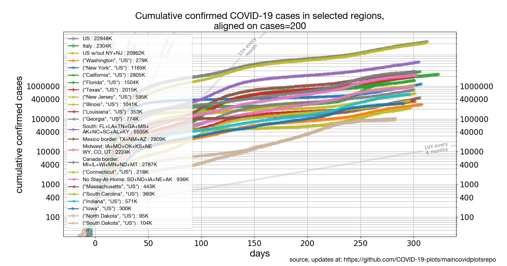

[[Regions around the world](../README.md) | [States of the US](../states) | [Latin America](../latinamerica) | [Europe](../europe) | [Mortality](../mortality)]

## [US States confirmed cases](#focus-on-us-states):

* [States of the US: Daily percentile growth rates](#states-of-the-us-daily-percentile-growth-rates)
* [States of the US: cumulative number of confirmed cases by state, aligned on equal caseload](#states-of-the-us-cumulative-number-of-confirmed-cases-aligned-on-equal-caseload)
* [States of the US: Cumulative number of cases](#states-of-the-us-cumulative-number-of-cases)
* [States of the US: New cases per day](#states-of-the-us-new-cases-per-day)
* [States of the US: New deaths per day](#states-of-the-us-new-deaths-per-day)

## Focus on US states

### States of the US: Daily percentile growth rates

Click on the plot to see an expanded version.

### States of the US: cumulative number of confirmed cases, aligned on equal caseload

Click on the plot to see an expanded version.

### States of the US: Cumulative number of cases

Click on the plot to see an expanded version.

### States of the US: New cases per day

Click on the plot to see an expanded version.

### States of the US: New deaths per day

Click on the plot to see an expanded version.

