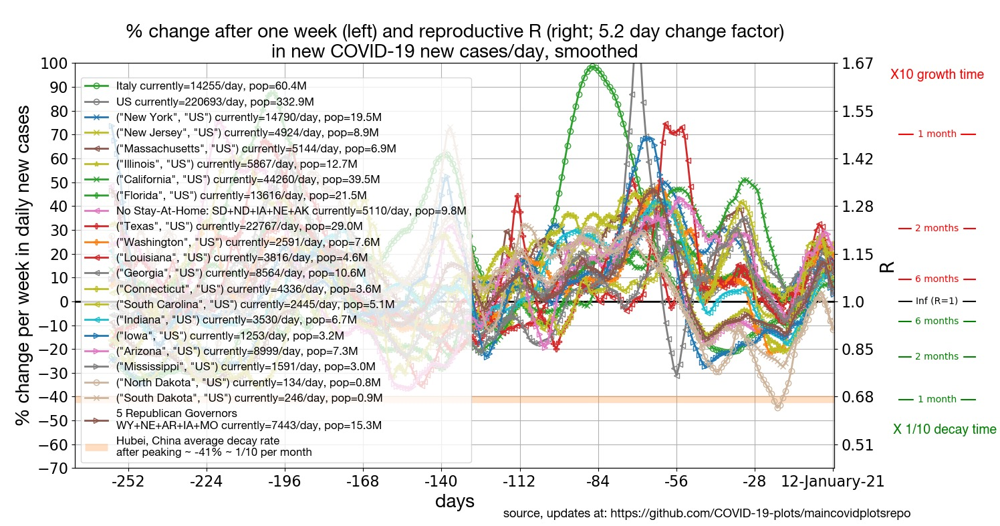
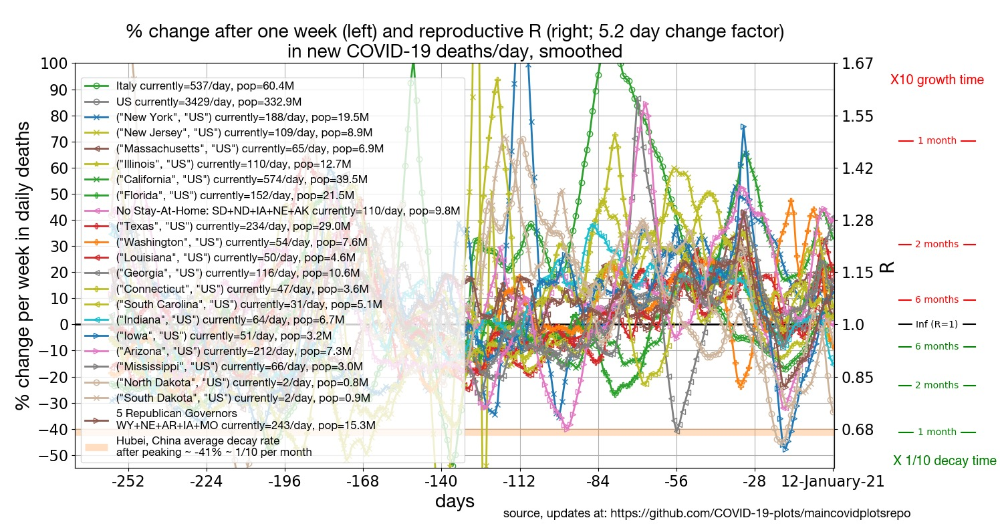
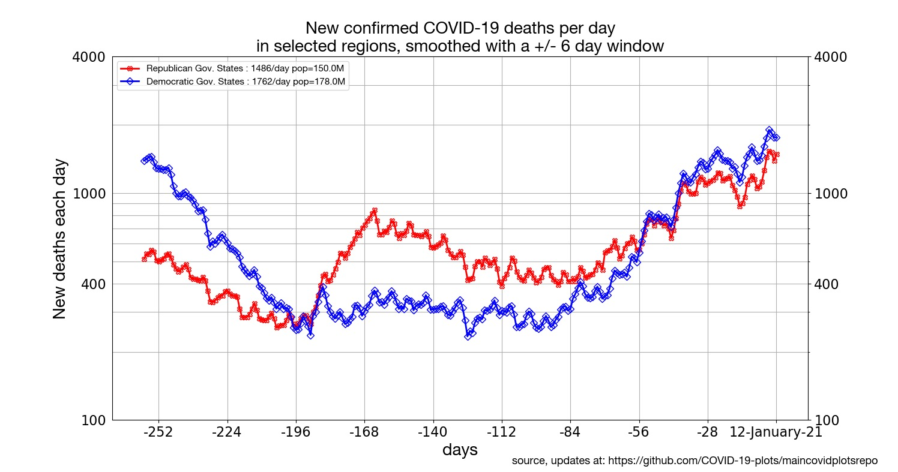
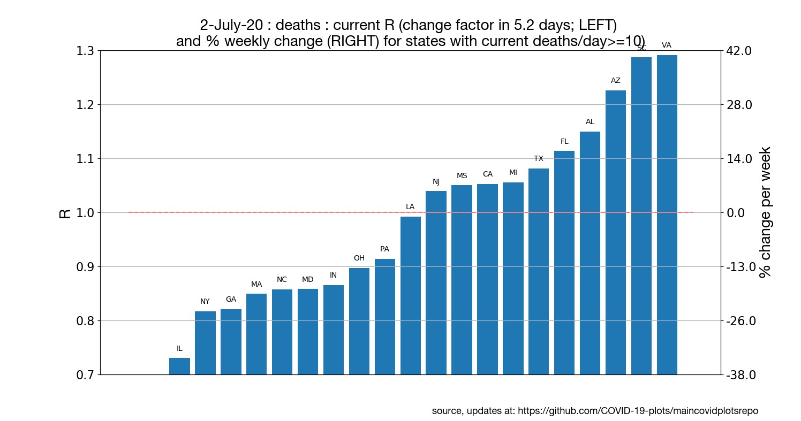
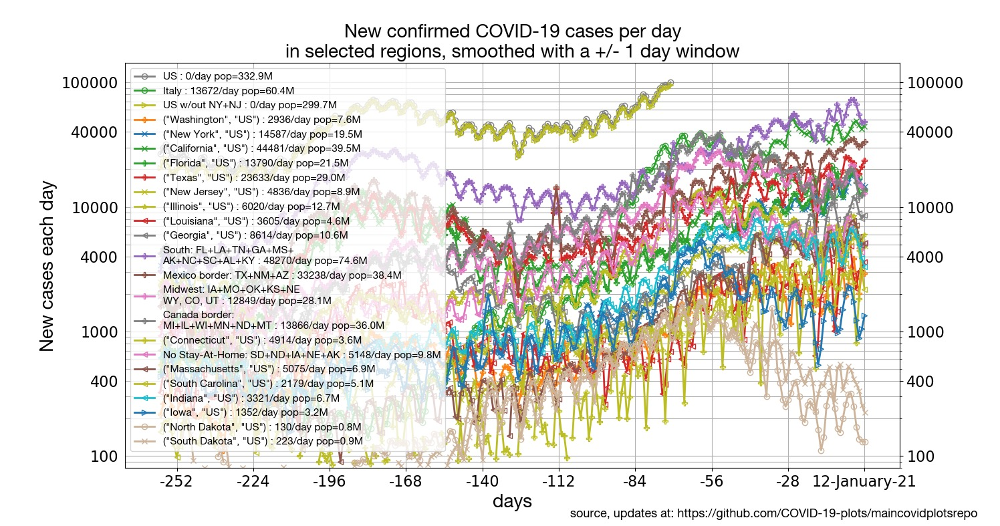
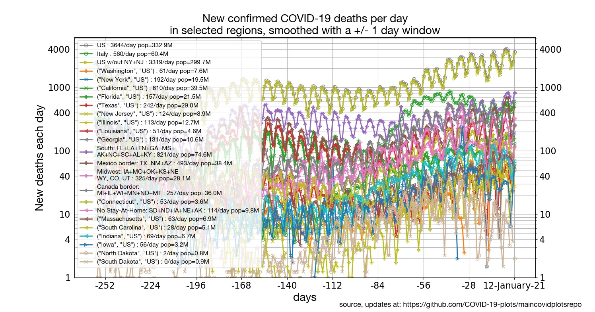
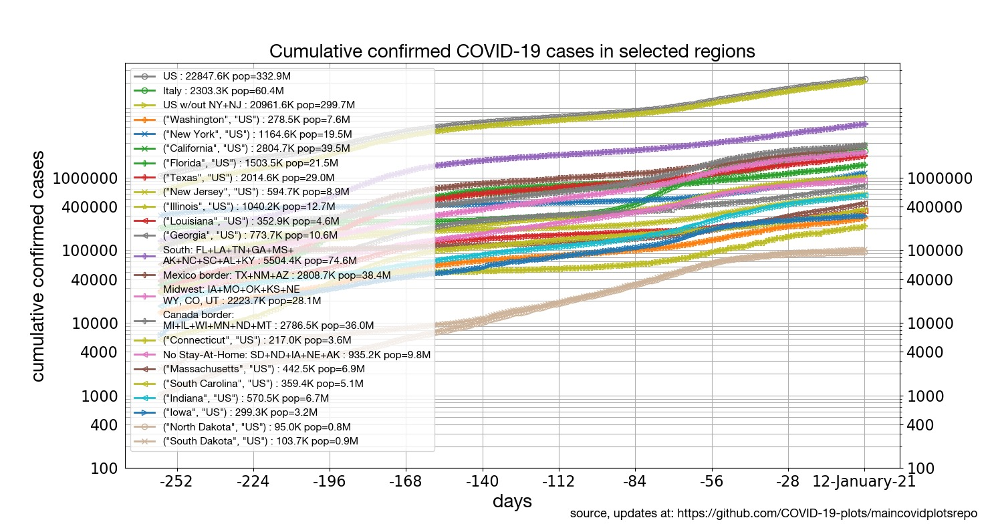

[[Regions around the world](../README.md) | [States of the US](../states) | [Latin America](../latinamerica) | [Europe](../europe) | [Mortality](../mortality)]

## US States confirmed cases and deaths

* [US States: New cases growth rates](#us-states-new-cases-growth-rates)
* [US States: New deaths growth rates](#us-states-new-deaths-growth-rates)
* [US States: Republican v Democratic Govs](#us-states-republican-v-democratic-govs)
* [US States: All states, current deaths growth rates](#us-states-all-states-current-deaths-growth-rates)
* [US States: New cases per day](#us-states-new-cases-per-day)
* [US States: New deaths per day](#us-states-new-deaths-per-day)
* [US States: Cumulative number of confirmed cases by region, aligned on equal caseload](#us-states-cumulative-number-of-confirmed-cases-by-region-aligned-on-equal-caseload)
* [US States: Cumulative number of cases](#us-states-cumulative-number-of-cases)
* [US States: Daily percentile growth rates](#us-states-daily-percentile-growth-rates)

## Focus on US States

### US States: New cases growth rates

Click on the plot to see an expanded version.

### US States: New deaths growth rates

Click on the plot to see an expanded version.

### US States: Republican v Democratic Govs

Click on the plot to see an expanded version.

### US States: All states, current deaths growth rates

Click on the plot to see an expanded version.

### US States: New cases per day

Click on the plot to see an expanded version.

### US States: New deaths per day

Click on the plot to see an expanded version.

### US States: Cumulative number of confirmed cases by region, aligned on equal caseload

Click on the plot to see an expanded version.

### US States: Cumulative number of cases

Click on the plot to see an expanded version.

### US States: Daily percentile growth rates

Click on the plot to see an expanded version.

