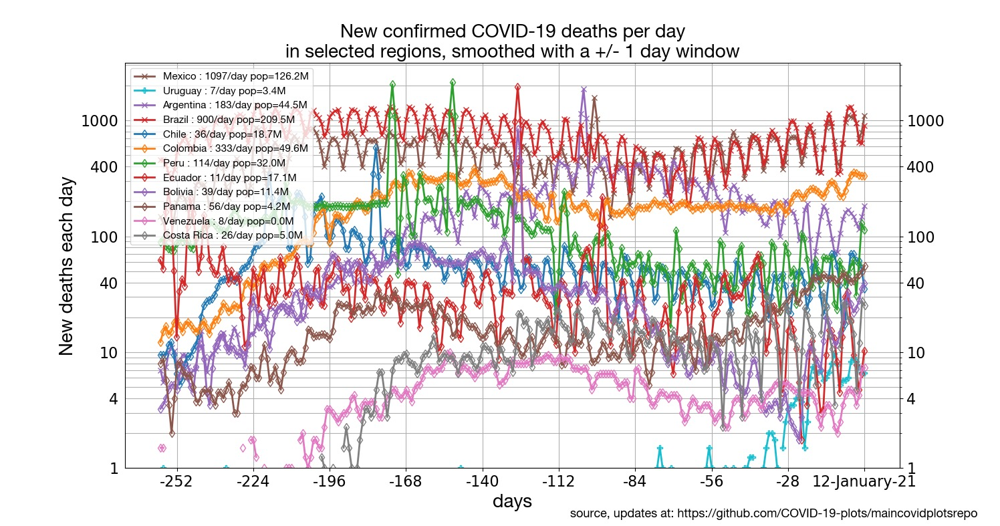
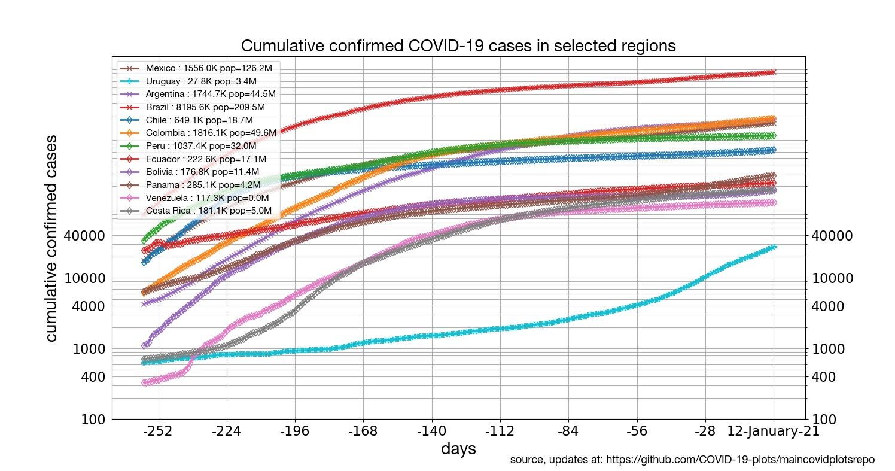
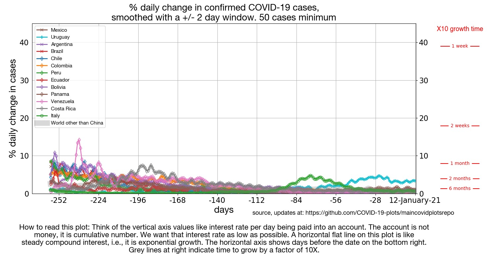

[[Regions around the world](../README.md) | [States of the US](../states) | [Latin America](../latinamerica) | [Europe](../europe) | [Mortality](../mortality)]

## Latin America confirmed cases and deaths

* [Latin America: New cases per day](#latin-america-new-cases-per-day)
* [Latin America: New deaths per day](#latin-america-new-deaths-per-day)
* [Latin America: Cumulative number of confirmed cases by region, aligned on equal caseload](#latin-america-cumulative-number-of-confirmed-cases-by-region-aligned-on-equal-caseload)
* [Latin America: Cumulative number of cases](#latin-america-cumulative-number-of-cases)
* [Latin America: Daily percentile growth rates](#latin-america-daily-percentile-growth-rates)

## Focus on Latin America

### Latin America: New cases per day

Click on the plot to see an expanded version.

### Latin America: New deaths per day

Click on the plot to see an expanded version.

### Latin America: Cumulative number of confirmed cases by region, aligned on equal caseload

Click on the plot to see an expanded version.

### Latin America: Cumulative number of cases

Click on the plot to see an expanded version.

### Latin America: Daily percentile growth rates

Click on the plot to see an expanded version.

